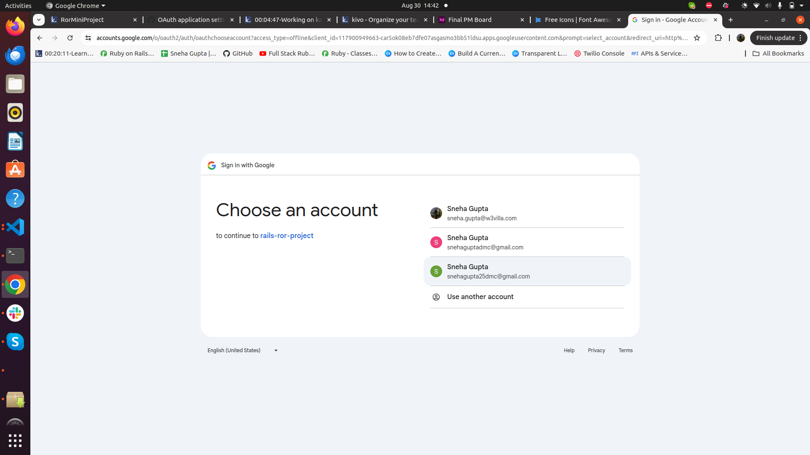

# README

Name of the project:-Nxtrendz

Functionality:-

Home page

In Home page I have added navbar with contain signup and sign in route which redirects to respective page

1. Signup

This is the sign up page in which user required to input email,password, profile picture and mobile number

   
2.Email verification (As confirmation link is send to the user's email)

User required to do email verification ,when sign up button is clicked it sends email confirmation link to user's gmail then when user clicks on confirmation link then email is verified successfully
3.Phone verification through otp using Twilio

when email verification is done,it sends otp to mobile number then user required to verify otp if otp is not received you can resend otp and verify accordingly.I have also implemented such that otp expires after 1 min then user required to resend otp.
Social login

4.Gmail login using Google auth

Gmail login is implemented using Omniauth

5.Facebook login

facebook login is implemented using omniauth 

6.Sign in 

User allowed to login only when email and otp is verified 

dashboard page

7.Sign out

8.Profile picture upload

Course plan page

.Basic plan
.Silver plan
.Platinum plan

9.Payment gateway using Stripe

Payment successful page

